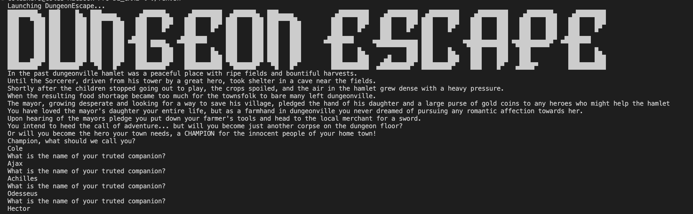
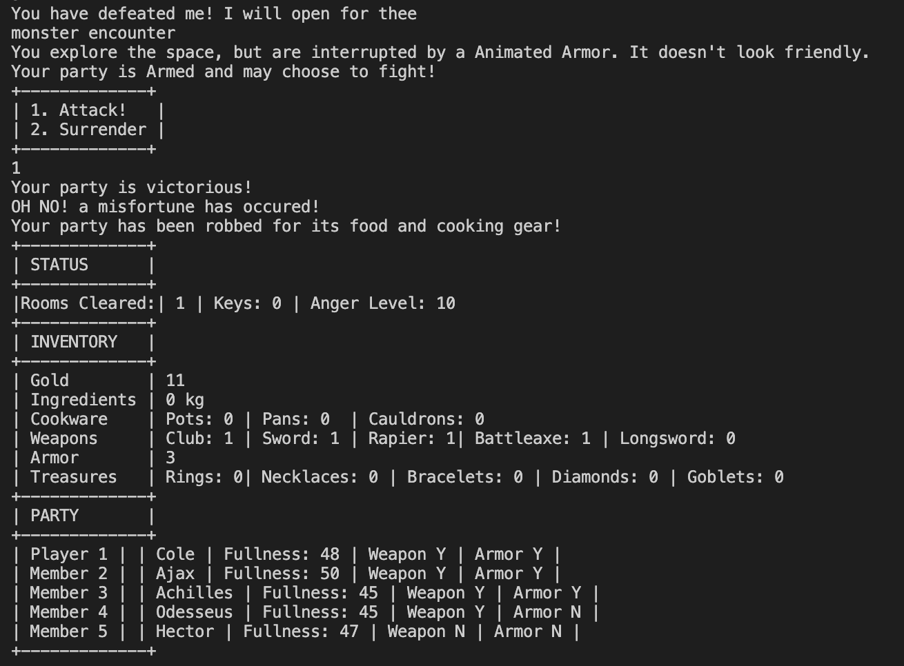
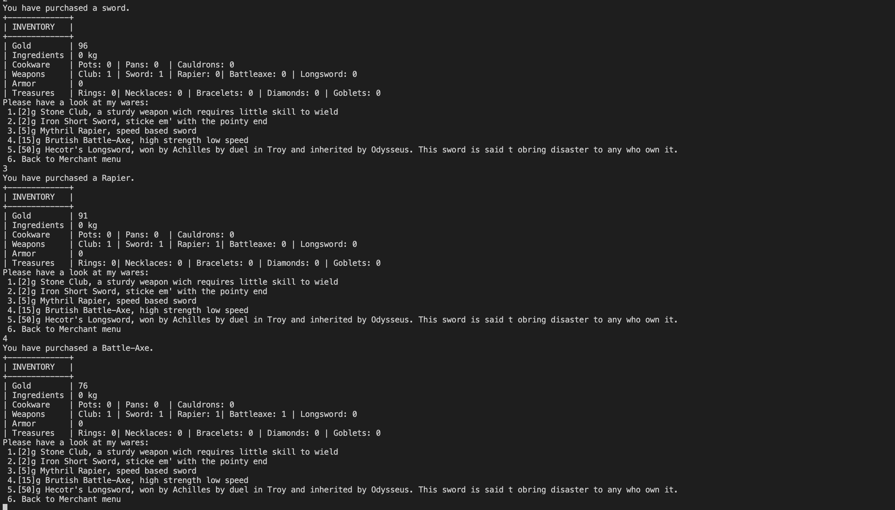

# DungeonEscape (Binary Demo)

A text-based dungeon crawler featuring combat, merchants, riddles, and loot.  
Originally created for **CSCI 1300 (Fall 2022) Project 3** by Cole Akers.

⚠️ **Note:** The original C++ source code was lost.  
This repo provides a working binary (`dungeonescape`), assets, and demo materials for portfolio purposes.

---
## 📸 Demo

### Screenshots

**Start Screen**  


**Battle Example**  


**Loot / Merchant**  


---

### 🎥 Gameplay Demo

Watch a short recording of the game in action:  
[▶️ Watch Gameplay Demo]([docs/screenshots/DE_demo.mp4](https://youtu.be/Wcc1idMOPzo))

## 🚀 How to Run

Clone the repo and use the provided launcher:

```bash
git clone https://github.com/wiak0179/DE_GAME.git
cd DE_GAME
./run.sh   

